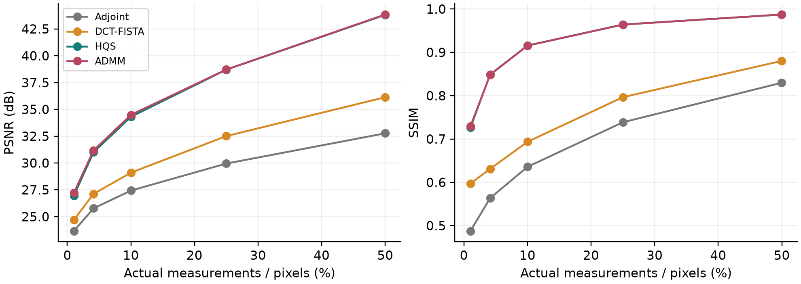
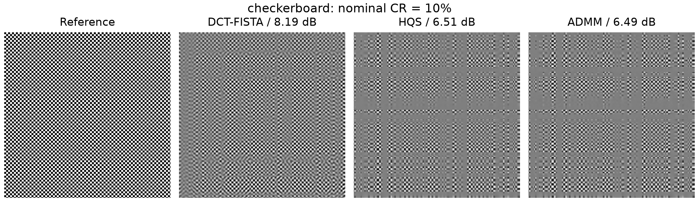
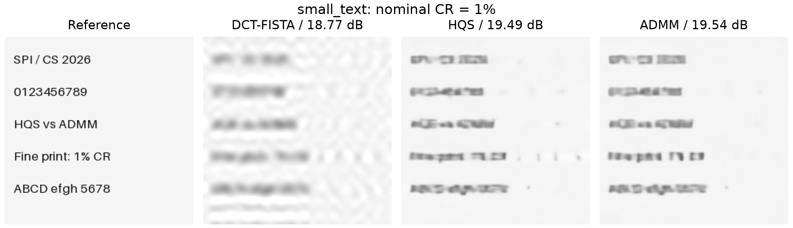
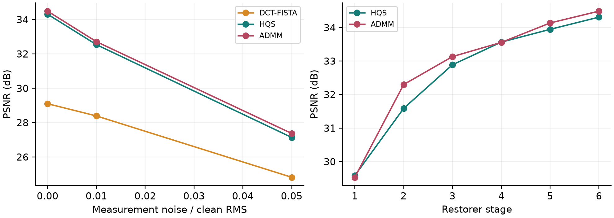

# Single-Pixel Imaging under Limited Measurements: A Reproducible Study of Sparse Recovery and ProxUnroll

Zicong Luo (522026230043), Shuhao Yang (502026230083), Yubowen Li (502026230092)

## Abstract

Single-pixel imaging reconstructs a spatial image from integrated optical measurements. This project studies how reconstruction priors affect quality when the number of measurements is limited. We reproduce the released HQS and ADMM variants of ProxUnroll and compare them with adjoint reconstruction and an independently implemented DCT-sparse FISTA solver. All methods receive the same measurements and sensing matrices. The evaluation uses six public grayscale test images, two independent validation images, and two synthetic stress targets at 256 x 256 pixels. Five clean sampling rates and two measurement-noise levels expose both reconstruction gains and failure cases. At nominal 10% sampling, HQS obtains 34.31 dB / 0.916 SSIM and DCT-FISTA obtains 29.10 dB / 0.694 SSIM. We additionally examine intermediate stages and disable feature memory at inference. All reported results in this report come from the included run, not from the original paper tables. This is a pretrained-model evaluation and software simulation, with no claim of optical acquisition or training from scratch.

## 1. Introduction

A conventional image sensor records spatially separated values in parallel. A single-pixel system instead applies a sequence of spatial masks and records one integrated response per mask. Reconstruction then uses the known masks to infer spatial structure. The attraction is particularly clear when a sensitive detector is available but an affordable detector array is not. The computational cost is paid after acquisition, while the required sequence of measurements imposes a temporal cost and a sensitivity to scene motion.

Topic 7 connects the foundational camera and compressed-sensing formulation of Duarte et al. [1] with proximal algorithm unrolling in Wang et al. [2]. The classic formulation supplies the acquisition model and motivates sparsity as a prior. The modern approach introduces a learned image restorer into a short optimization trajectory. Our comparison focuses on the reconstruction component under a controlled acquisition model, rather than attempting to rebuild either paper's entire experimental apparatus.

A successful demonstration on one image would leave several questions unresolved. Does the reconstruction advantage survive when the sampling rate changes? Does it depend on using different measurements? How much detail disappears under severe compression? Does a pretrained natural-image prior remain reliable for text and periodic patterns? We translate these questions into repeatable experiments, retaining failures as evidence.

## 1.1. Contributions and Scope

The project contribution is an audited evaluation package around the released network. We add a measurement-only reconstruction interface and verify its clean-output equivalence to the original implementation. We implement a classical sparse baseline using the identical separable operator, tune its regularization on disjoint validation images, and preserve individual results instead of reporting only averages. We include sampling sweeps, noisy measurements, stage trajectories, an inference-time memory intervention, and difficult image examples.

We use the authors' pretrained weights without fine-tuning. Reusing a pretrained network is therefore part of the method, and its training cost and training-data exposure remain relevant limitations. The study is neither a new reconstruction architecture nor a reproduction of the full CVPR benchmark. The classical baseline is inspired by the sparse inverse-problem formulation in [1], but it is not claimed to be the exact algorithm or hardware implementation of that paper.

## 1.2. Evidence and Reproducibility

The project stores image provenance, file hashes, checkpoint hashes, package versions, raw metrics, image reconstructions, and stage-level measurements. Every comparison in the report can be traced to a CSV row. Inputs used for parameter selection are excluded from reported test means. The test suite is small and intentionally diverse; the resulting numbers describe these images and should not be generalized to an entire dataset or application domain.

## 2. Forward Model and Reconstruction

Let X be a normalized h x w grayscale image. With separable sensing factors H and W, the measurement model is Y = H X W<super>T</super> + E. Vectorization gives y = A x + e with A = W (Kronecker product) H, under column-major vectorization. Each row of A describes a spatial mask. We never construct this dense operator, since two smaller matrix products implement the same linear transformation.

Define A(X) = H X W<super>T</super> and A*(Y) = H<super>T</super> Y W. The second operator is the adjoint, as verified by the inner-product identity &lt;A(X), Y&gt; = &lt;X, A*(Y)&gt;. It maps measurements back to image space but cannot restore unmeasured information on its own. For squared measurement error, the gradient is A*(A(X) - Y). This common expression underlies both our classical optimizer and the network's data-consistency update.

The repository requests ceil(h sqrt(r)) rows from H and ceil(w sqrt(r)) rows from W for nominal ratio r, capped by stored factor sizes. The realized ratio is r_actual = m_h m_w / (hw), using the available selected rows. We record both ratios. At 256 x 256, nominal 1% contains 26 x 26 measurements (1.0315%). The released factors contain only 181 rows each, so nominal 50% uses 181 x 181 measurements (49.9893%), rather than the requested 182 x 182.

## 2.1. Adjoint and DCT-FISTA Baselines

Adjoint reconstruction returns X0 = A*(Y). It provides a useful reference for how much quality comes directly from the measurement model. The sparse baseline solves min_X 0.5 ||A(X) - Y||<super>2</super>F + lambda ||D(X)||1, where D is an orthonormal two-dimensional discrete cosine transform. This objective encourages a compressible frequency representation while keeping the measurements consistent.

Starting from X0, FISTA [3] alternates a gradient step and soft thresholding in the DCT domain, with its standard momentum update. The threshold is lambda/L, where L = ||H||2<super>2</super> ||W||2<super>2</super>. This spectral bound avoids assuming exact row orthogonality. The inverse orthonormal DCT converts thresholded coefficients back into an image. We run 200 iterations and select one global lambda from a small validation grid. Reconstruction remains unconstrained during optimization; clipping to [0,1] occurs only for evaluation and export.

The transform and fixed iteration budget make this baseline interpretable and easy to reproduce. They also limit the comparison: DCT sparsity is only one classical prior, and a stronger TV or wavelet method could change the ranking. FISTA is a modern optimizer for a classical sparsity objective, rather than the precise reconstruction code used in the 2008 camera study.

## 2.2. Released ProxUnroll Inference

The released implementation uses six restorer stages with shared restorer parameters. Its HQS update has the form Z = X + rho_k A*(Y - A(X)), followed by X_next = R_theta(Z, memory). ADMM additionally maintains a scaled dual variable U: it applies the consistency update to X - U, feeds Z + U to the restorer, and updates U_next = U + Z - X. We preserve these operations and all checkpoint parameters.

The restorer combines convolution and window attention with an encoder-decoder structure. Its stored feature memory supplies information from the previous stage. In the paper, proximal trajectory supervision encourages intermediate restoration steps to resemble ideal proximal targets [2]. The reference target depends on the clean image during training. It is not available during deployment. Our new inference function accepts only Y, the image shape, and the sampling ratio, so it cannot read the reference image.

The original forward function also creates target-related outputs for training. Our inference path omits that branch, while a regression check compares every restorer-stage output with the original forward result. Strict checkpoint loading rejects missing or unexpected parameters. Inspection finds different sensing factors in the two checkpoints. The main experiment therefore supplies the same external factors from the released 256 x 256 MAT file to both networks. It measures reconstruction after transfer to a common operator. Separate native-operator checks at 10% preserve the original checkpoint factors.

## 2.3. Interpretation of Interventions

Intermediate-stage evaluation and feature-memory removal are inference interventions on a fixed checkpoint. They do not isolate the causal effect of a training loss or substitute for independently retrained ablations. Likewise, observing improved quality across six stages cannot prove convergence of an indefinitely repeated learned operator. We use these measurements only to characterize the released finite computation.

## 3. Experimental Protocol

The test split contains camera, astronaut, coins, moon, page, and clock from skimage.data. Coffee and chelsea are reserved for validation. We convert RGB inputs to the OpenCV Y channel and resize each image to 256 x 256 using area interpolation. The resize can alter aspect ratio; these results must not be presented as an official Set11 or CBSD68 evaluation. Checkerboard and small_text are procedural stress targets and are excluded from natural/test-image means.

The baseline validation grid is lambda in {0.001, 0.005, 0.02}, evaluated at nominal ratios 1%, 10%, and 50% on the two validation images. The selected value is 0.001. This one value is then frozen across the test conditions, including noisy conditions. The network weights are also frozen. No test image selects a parameter.

The clean sweep uses r in {0.01, 0.04, 0.10, 0.25, 0.50}. At r = 0.10, two noise levels use E = sigma RMS(Y_clean) N(0,1), with sigma in {0.01, 0.05}. Each image/noise condition uses three seeded realizations. Methods receive the same noisy measurement array. This is a signal-relative Gaussian perturbation model, not calibrated shot noise or a claim about a real photodetector.

## 3.1. Metrics and Aggregation

PSNR uses peak value 1 after output clipping. SSIM uses the skimage default spatial window with data_range=1. There is no border crop. We average per-image PSNR and SSIM, rather than pooling all pixel errors before calculating PSNR. For noisy conditions, we first average repeats within each image. Test means and stress-target results remain separate. Timing excludes acquisition and data transfer but includes reconstruction itself.

## 4. Clean Reconstruction Results

Table 1. Mean clean PSNR (dB), six images. CR labels are nominal; Figure 1 uses realized ratios.

CR | FISTA | HQS | ADMM

1% | 24.70 | 26.96 | 27.21

4% | 27.12 | 31.00 | 31.17

10% | 29.10 | 34.31 | 34.49

25% | 32.50 | 38.70 | 38.71

50% | 36.13 | 43.80 | 43.84

At 10% nominal sampling, HQS averages 34.31 dB and ADMM averages 34.49 dB, compared with 29.10 dB for the tuned DCT baseline. The paired HQS-minus-FISTA difference is 5.21 dB. Resampling the six image-level differences 10,000 times gives a descriptive 95% percentile interval [4.07, 6.29] dB. The small, selected image suite limits any population interpretation.

Figure 1 describes quality as the measurement budget increases. More measurements reduce the dimension of the unobserved image space, but the trained restorer and the chosen regularization still influence the result. The comparison measures the benefit of these specific pretrained networks over this specific sparse baseline. It does not establish superiority to every classical reconstruction method.

Content strongly affects the aggregate. The clock source is already motion blurred and therefore relatively smooth, whereas page contains fine printed strokes. A very high score on smooth content can raise the mean without resolving text failures. Per-image scores and the separate stress figures should accompany any interpretation of the averages.

## 5. Failure Cases and Interpretation

The stress targets intentionally depart from smooth natural-image content. The checkerboard concentrates energy in repeated high-frequency transitions. Small text contains thin strokes whose semantic identity can change after modest image distortion. Both examples test details that a global pixel metric can hide. They are procedurally generated targets, not self-captured data.

On the checkerboard at 10%, DCT-FISTA obtains 8.19 dB, exceeding HQS at 6.51 dB and ADMM at 6.49 dB. The learned outputs visibly contain incorrect coarse divisions and uneven pattern contrast. This reverses the average regular-image ranking and demonstrates a content-dependent failure of the pretrained prior under the common operator.

Figures 2 and 3 are direct exports from the measured reconstruction run. Under severe undersampling, multiple images can fit nearly the same measurement values. A prior must fill that ambiguity, and its preferred texture or smoothness need not match the scene. The appropriate failure analysis considers lost boundaries, merged strokes, suppressed contrast, and repeated-pattern errors, rather than relying only on a high average PSNR.

DCT sparsity can remove small coefficients that collectively encode thin edges. A learned restorer can also suppress structures that are unusual relative to its training distribution. Neither method receives an OCR objective or a character-level constraint. Consequently, this report does not equate improved PSNR with reliable text transcription or recognition.

The lowest HQS score among the six regular evaluation images at 10% is associated with page. The additional comparison_2.png figure records its 1% reconstruction, enabling inspection of the same content under a more severe measurement shortage. The selection rule is explicit: the image is selected by its 10% HQS score, and the stress views have fixed rates rather than hand-selected favorable conditions.

An operational response would be to acquire additional measurements, check reconstruction stability under measurement perturbation, or flag content where a task-specific requirement is not met. Such an acquisition policy is outside this implementation. Post-processing a plausible-looking image cannot certify that missing details were recovered correctly.

## 6. Noise, Stages, and Runtime

For HQS, mean PSNR changes from 34.31 dB in the clean condition to 32.54 dB at 1% relative RMS noise and 27.14 dB at 5%. The same noise levels give ADMM 32.71 dB and 27.37 dB. Noise is applied to measurements, not to reconstructed pixels. Since all methods share the perturbation, differences cannot be attributed to receiving cleaner inputs.

Disabling HQS feature memory at 10% yields 30.58 dB versus 34.31 dB for the unmodified model. The intervention changes the input distribution seen by the trained network. It measures sensitivity to that change, not the performance of a separately trained architecture without memory. Figure 4 also shows that evaluating intermediate outputs is necessary to assess a short trajectory; final-image quality alone cannot describe every stage.

Table 2. Quality and median reconstruction time at nominal 10%. Timing is specific to this environment and implementation.

Method | PSNR | SSIM | Median seconds

Adjoint | 27.43 | 0.636 | 0.000

FISTA | 29.10 | 0.694 | 0.202

HQS | 34.31 | 0.916 | 2.515

ADMM | 34.49 | 0.915 | 2.617

Experiments use macOS-27.0-arm64-arm-64bit with PyTorch 2.14.0, device cpu, and 4 CPU threads. One full warmup precedes neural timing. GPU backends, when selected, synchronize around timed regions. Classical algorithms run on CPU. FISTA timing includes its spectral-norm calculation. These single-execution timings characterize the local workflow and do not reproduce the paper's hardware speed claims.

## 6.1. Checkpoint-Native Operators

At 10%, HQS with its own checkpoint factors achieves 34.45 dB; its matched DCT-FISTA comparator achieves 29.04 dB. ADMM with its own factors achieves 34.48 dB; the corresponding FISTA score is 29.09 dB. These measurements supplement the common-operator experiment. Comparing HQS and ADMM across their native operators changes both sensing and reconstruction, so that difference cannot be assigned to the solver alone.

## 7. Validity and Reproduction

The completed run contains 352 metric records and 1056 stage records. The repository includes the dataset-generation command, pinned environment, run command, raw CSV files, source and checkpoint hashes, and report-generation scripts. A separate test checks the adjoint identity and an analytically solvable FISTA case. Clean neural outputs must match the original forward path. The report builder rejects an incomplete run.

A fresh evaluation is launched with python -m coursework.run_experiments --device cpu --output coursework/results-repeat after installing requirements-coursework.txt and generating the data. The output directory must be new, so a repeat cannot silently overwrite the delivered measurements. The main metrics file contains an image identifier, split, nominal and actual ratios, noise level, seed, method, quality scores, elapsed seconds, and a relative measurement residual. The original floating-point metrics are retained even though visualization files are quantized.

## 7.1. What the Checks Establish

The adjoint test checks the linear-algebra contract independently of reconstruction quality. The FISTA test uses an identity sensing operator, for which orthonormal transform shrinkage has a known solution. The network check loads the actual released checkpoints strictly and compares every output stage with the original path, including the matrix-size cap at nominal 50%. These tests catch implementation mismatches, but cannot certify that a pretrained prior is appropriate for every scene.

The learned data-consistency coefficients are unconstrained parameters in the released code. Consequently, a learned correction should not automatically be identified with the exact convex proximal formula for a strictly positive penalty. Our implementation preserves those coefficients and evaluates the resulting finite network. This distinction is another reason to separate empirical trajectory measurements from general convergence claims.

Important limits remain. The common MAT-file operator differs from the checkpoint-native factors, so main results include operator transfer. There are only six regular evaluation images, and training-data overlap has not been audited. Measurements omit optical calibration, quantization, motion, and photon statistics. Validation covers only clean conditions. Neither architecture training nor the causal effect of trajectory loss is reproduced. No full-color reconstruction or physical camera experiment is claimed.

## 8. Conclusion and AI Disclosure

The project supplies a reproducible comparison of explicit sparsity and learned proximal unrolling under shared measurements. Sampling, noise, and content affect reconstruction reliability, and the stress cases show why an average metric is insufficient. A larger independent image set and matched retraining would be the next steps toward stronger conclusions.

Codex assisted with implementation, experiment execution, analysis, report writing, and presentation preparation. Model architecture and weights originate from the cited authors. The student team must review the code, verify the results, and be able to explain the method and limitations before submission. No member-specific contribution or unperformed experiment is claimed.

## References

[1] M. F. Duarte et al. Single-Pixel Imaging via Compressive Sampling. IEEE Signal Processing Magazine, 25(2):83-91, 2008. doi:10.1109/MSP.2007.914730.

[2] P. Wang et al. Proximal Algorithm Unrolling: Flexible and Efficient Reconstruction Networks for Single-Pixel Imaging. CVPR, 2025. arXiv:2505.23180. Code: github.com/pwangcs/ProxUnroll.

[3] A. Beck and M. Teboulle. A Fast Iterative Shrinkage-Thresholding Algorithm for Linear Inverse Problems. SIAM Journal on Imaging Sciences, 2(1):183-202, 2009. doi:10.1137/080716542.

[4] S. van der Walt et al. scikit-image: image processing in Python. PeerJ 2:e453, 2014. doi:10.7717/peerj.453. Image provenance: skimage.org/docs/stable/api/skimage.data.html.
