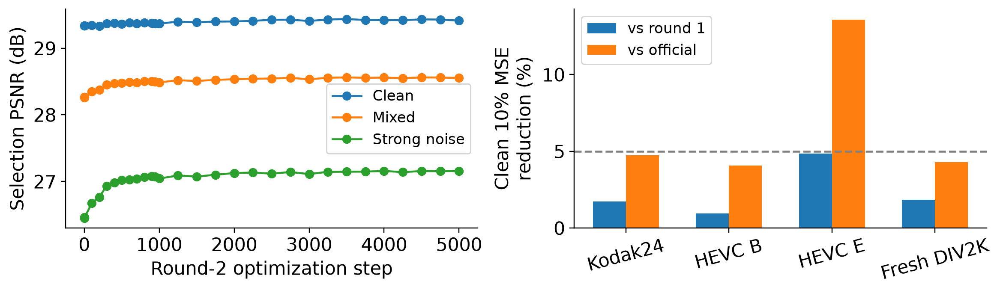
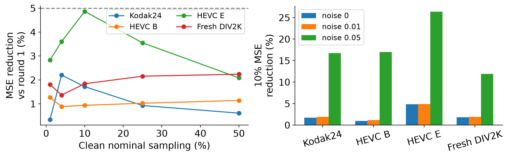
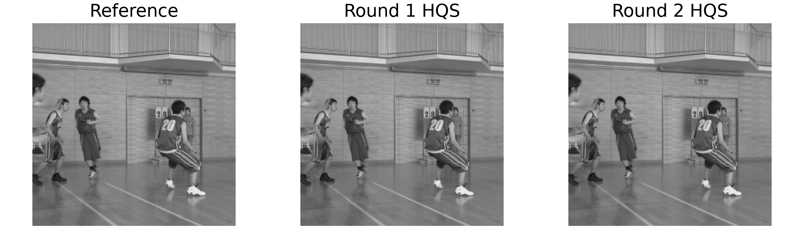

# Single-Pixel Imaging under Limited Measurements: Noise-Aware Fine-Tuning and Paired Error Evaluation

Zicong Luo (522026230043), Shuhao Yang (502026230083), Yubowen Li (502026230092)

## Abstract

We compare four solvers for simulated single-pixel imaging and extend a short HQS fine-tuning pilot with a bounded noise-aware experiment. All sensing factors stay fixed. The second round uses 800 DIV2K training originals and 16 selection originals; 32 additional originals form a previously unevaluated test set. Kodak24 and spaced HEVC frames provide regression comparisons because their earlier scores were already observed. The selected state comes solely from validation. The fresh DIV2K clean 10% MSE reduction is +1.84% versus round 1, with a paired 95% interval [0.68, 3.48]%; the requested minimum 5% is not met by this point estimate. All negative changes and recovery checkpoints are retained.

## 1. Problem and Prior Work

Single-pixel imaging collects integrated responses under known spatial patterns [1]. This coursework simulates acquisition from existing grayscale images. ProxUnroll [2] shares a convolution/attention restorer across optimization stages. We use released HQS and ADMM weights and attribute the architecture to its authors. DCT-FISTA [3] and the adjoint provide classical comparisons.

## 2. Common Measurement Contract

Y = H X W<super>T</super> + E, with X a 256 x 256 grayscale image. Every solver receives identical factor rows and measured values. The common MAT operator is fixed for training and testing, although it differs from checkpoint-native factors. HQS performs residual correction and learned restoration; ADMM adds a dual update. Six-stage memory links iterations within one image, not video frames.

DCT-FISTA uses 200 iterations and lambda 0.001 from the original separate validation study. We do not choose its regularization on Kodak, HEVC or the fresh DIV2K tests. Nominal clean sampling ratios are 1%, 4%, 10%, 25% and 50%; stored row counts determine the actual ratio. At 50%, 181 x 181 available measurements give 49.9893%.

At 10%, Gaussian measurement noise has relative RMS 0.01 or 0.05, each with three predeclared seeds. Predictions are clipped to [0,1]. PSNR and skimage SSIM use data_range 1 and no border removal. Floating-point metrics precede display PNG quantization. Reconstruction arrays, measurements hashes and source hashes support independent recalculation.

## 3. Data and Leakage Controls

Public Kodak24 and laboratory-held HEVC B/E files are existing data, not self-captured photographs. The eight HEVC videos are BQTerrace, BasketballDrive, Cactus, Kimono1, ParkScene, FourPeople, Johnny and KristenAndSara. Each supplies frames 0, floor(N/3), floor(2N/3). All videos belong entirely to test; no adjacent training frames are used.

The HEVC files match 8-bit planar YUV420 packing, canonical dimensions and integral byte counts. BQTerrace stores 601 frames and BasketballDrive 501, each one beyond its nominal version. We use the actual lengths and raw Y planes. Raw range metadata are absent, so stored Y/255 is preserved without guessed TV/full expansion. Manifests record source hashes, frame hashes, dimensions, frame numbers and observed ranges.

Every validation/test view uses the largest centered square, then OpenCV INTER_AREA resize to 256 x 256. PNG RGB uses OpenCV RGB2YCrCb Y. The centered crop changes the task and discards side content. DIV2K [4] training originals receive valid step-seeded square crops and flips only after source-image split assignment.

Round 1 trained on 128 originals for 100 updates. Round 2 uses all 800 official DIV2K training originals and keeps the same 16 selection originals. Thirty-two test originals are selected by fixed evenly spaced indices among the remaining 84 official validation originals. Source hashes are disjoint between all current groups. These 32 were not evaluated in round 1 or used for this selection. Official pretraining exposure is not fully audited.

Kodak/HEVC already informed the observation that strong-noise results were weak in round 1, so their round-2 scores are explicitly regression tests. The fresh DIV2K split adds evidence against repeated test adaptation. No round-2 test result is used to choose checkpoints, change the training recipe or stop training.

## 3.1. Experimental Units

Noise seeds average within image, frames within video, then videos equally within each HEVC class. Still images are equal original-image units. MSE percentages use the ratio of equally weighted mean MSE values. They are not percentages of PSNR numbers or a conversion of mean PSNR gains. Bootstrap intervals resample paired originals or entire videos.

## 4. Four-Method Controls

Table 1 reports four-method controls at clean 10% sampling, in PSNR dB. Kodak/HEVC use the preserved first evaluation; fresh DIV2K controls run after checkpoint selection is frozen. All share the common operator. HEVC averages videos equally.

Dataset | Adjoint | FISTA | HQS | ADMM

Kodak24 | 24.67 | 25.18 | 29.38 | 29.43

HEVC B | 25.88 | 26.77 | 31.22 | 31.28

HEVC E | 24.90 | 26.30 | 33.55 | 33.51

Fresh DIV2K | 22.51 | 23.23 | 27.02 | 27.07

The first full sweep retained 2,112 main rows and 6,336 stage rows. The 100-update check used eight conditions and three states (official, selected, last): 1,152 main rows and 6,912 stage rows. Fresh four-method controls add 1,408 main and 4,224 stage rows, independently recomputed. The 352-row original study and all prior reports/decks remain preserved.

## 4.1. Round-2 Changes by Video

Table 2 reports MSE reductions of round 2 versus round 1 at 10%. Each row averages all three preselected frames and every specified noise repeat.

Video | Clean drop | Noise .05 drop

BQTerrace | +1.26% | +19.60%

BasketballDrive | +1.47% | +28.98%

Cactus | +0.82% | +8.33%

FourPeople | +2.67% | +22.31%

Johnny | +1.60% | +37.65%

Kimono1 | -0.45% | +14.94%

KristenAndSara | +7.26% | +22.71%

ParkScene | +0.94% | +10.50%

## 5. Predeclared Round-2 Training

Round 2 initializes strictly from the first validation-selected HQS weights and creates a new Adam optimizer at learning rate 1e-5. This is new fine-tuning initialization, not restoration of the first optimizer. Subsequent resumptions load the complete round-2 state. All six H/W parameter tensors remain frozen. Only reconstruction tensors update.

The loss changes to direct grayscale ground-truth weighted RMSE: 0.01 for each of five intermediate outputs and 0.95 for the final output. Training independently draws a ratio from .01,.04,.1,.1,.1,.25,.25,.5 and relative measurement RMS from 0,0,.01,.05. Half the draws are clean. The larger data coverage, objective and noise augmentation change together, so this experiment does not isolate their causal contributions.

Selection averages PSNR over 16 originals, 10%/25% ratios and noise 0/.01/.05 with fixed validation draws. A candidate is eligible only if its clean validation PSNR stays within 0.03 dB of initialization. Initialization itself is an eligible candidate. Selection and stopping never access test images.

The user extended the initial 1,000-update pilot to 5,000 total updates in this round before any test inference. The continuation is capped at 120 minutes, validates every 250 updates, and preserves the update rule and complete state. The original patience stop is disabled for this explicit step request; non-finite values and resource bounds still stop training. Full model, optimizer, scheduler, Python/NumPy/Torch/CUDA RNG, step, crop and noise records are saved atomically and reopened. A separate best file stores the selected state.

## 5.1. Runtime and Resume Verification

The verified peer is 192.168.1.244 and container luozc_mlvc. Its /workspace and /datasets mounts share storage with server 220. The project-local Python 3.11 / PyTorch 2.6.0 CUDA 12.4 environment passes dependency checks. A previously idle 24 GiB RTX 3090 is fixed by GPU UUID. No other project environment or running job is modified.

An actual 3+1 update resume matches uninterrupted four-update training bitwise for parameters, optimizer, scheduler and RNG, including crop, measurement and loss records. A separate one-update check confirms that the budget-extension driver restores the same full state and produces the same update. Round 2 totals 5000 updates: 946 in the first phase plus 4054 continued updates, stopping by step_limit. The two formal phases take 7309.2 s in total, with peak allocated memory 10.84 GiB. Validation selects round-2 step 4500. Independent audit confirms unchanged sensing factors and 427 updated reconstruction tensors in the last state.

## 6. Paired Test Outcomes

Table 3 gives clean 10% changes against the first 100-step HQS. Positive MSE reduction means less error. Intervals are paired 95% bootstrap intervals with one training seed; they do not capture training-seed variation.

Dataset | MSE drop | Delta dB | 95% MSE interval

Kodak24 | +1.72% | +0.054 | [+0.7, +3.2]%

HEVC B | +0.94% | +0.042 | [+0.4, +1.3]%

HEVC E | +4.86% | +0.171 | [+1.6, +7.3]%

Fresh DIV2K | +1.84% | +0.088 | [+0.7, +3.5]%

The fresh DIV2K clean 10% MSE reduction is +1.84% versus round 1, with a paired 95% interval [0.68, 3.48]%; the requested minimum 5% is not met by this point estimate.

## 6.1. Noise and Per-Video Results

Table 4 reports 10% MSE reductions against round 1 under all noise levels. The report includes weak or negative groups as well as gains.

Dataset | Clean | Noise .01 | Noise .05

Kodak24 | +1.72% | +1.92% | +16.75%

HEVC B | +0.94% | +1.16% | +16.99%

HEVC E | +4.86% | +4.88% | +26.38%

Fresh DIV2K | +1.84% | +1.92% | +11.89%

Round 2 saves 2,640 main metric rows and 15,840 stage rows. Independent verification recalculates every one of 2,640 floating-point reconstructions and regenerates measurement hashes. All methods share each measurement. Per-image differences and every negative case remain in CSV.

The full MSE video summary retains all eight sequences rather than selecting favorable frames. Each video has only three spaced views. These small class sample sizes limit generalization. Neural inference is per image and has no prior/future-frame input.

The comparison includes official HQS, first-round HQS and the second-round validation-selected state. Test inference runs after training, and all three use the same GPU and metric implementation. The last recovery state is preserved even if validation selected an earlier checkpoint.

## 7. Conclusions and Limits

The fresh DIV2K clean 10% MSE reduction is +1.84% versus round 1, with a paired 95% interval [0.68, 3.48]%; the requested minimum 5% is not met by this point estimate.

One training seed and one bounded recipe cannot establish a universal improvement. The larger training set, direct reconstruction objective and noise mixture were introduced together. Their separate effects remain unmeasured. Kodak/HEVC are repeated regression comparisons; the fresh DIV2K result is separate. All results apply to centered, resized grayscale views and a common separable operator.

The simulation omits optical calibration, detector hardware, physical masks, photon statistics and a complete color acquisition system. HEVC frames are independent single-image inverse problems. These results do not establish temporal video reconstruction or optical-camera performance.

## 8. Reproducibility

Remote root /workspace/ProxUnroll-main; new run runs/lab244_5000_20261009. data/ contains immutable manifests. finetune/ contains selected best.pth and full-state last.pth. comparison/ retains CSV, stages, arrays, PNGs, provenance and MSE analysis. logs/ records detached-job PID, output and exit status. The project guide and predeclared protocol supply exact commands, environment versions and checkpoint hashes.

## AI Disclosure

Codex assisted with code, remote execution, analysis, English writing and presentation. Architecture and released weights belong to the cited authors. Students must review and understand the work. No course submission or public release is claimed.

## References

[1] Duarte et al. Single-Pixel Imaging via Compressive Sampling. IEEE Signal Processing Magazine, 2008. doi:10.1109/MSP.2007.914730.

[2] Wang et al. Proximal Algorithm Unrolling: Flexible and Efficient Reconstruction Networks for Single-Pixel Imaging. CVPR 2025. arXiv:2505.23180; github.com/pwangcs/ProxUnroll.

[3] Beck and Teboulle. A Fast Iterative Shrinkage-Thresholding Algorithm for Linear Inverse Problems. SIAM J. Imaging Sciences, 2009. doi:10.1137/080716542.

[4] Agustsson and Timofte. NTIRE 2017 Challenge on Single Image Super-Resolution: Dataset and Study. CVPR Workshops 2017; data.vision.ee.ethz.ch/cvl/DIV2K/.
