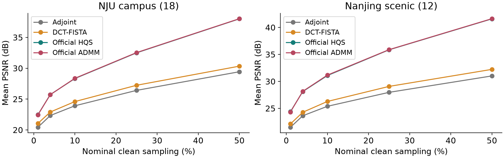
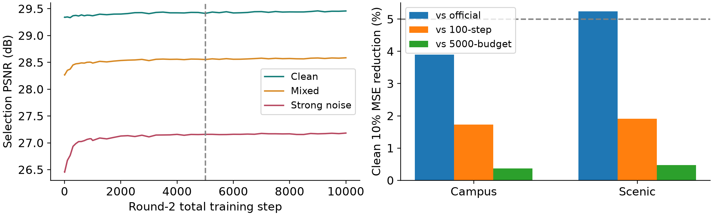
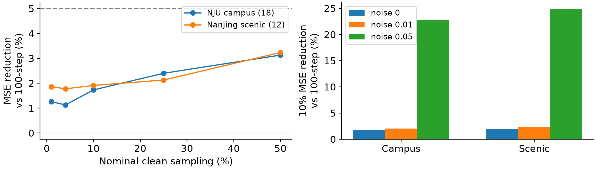
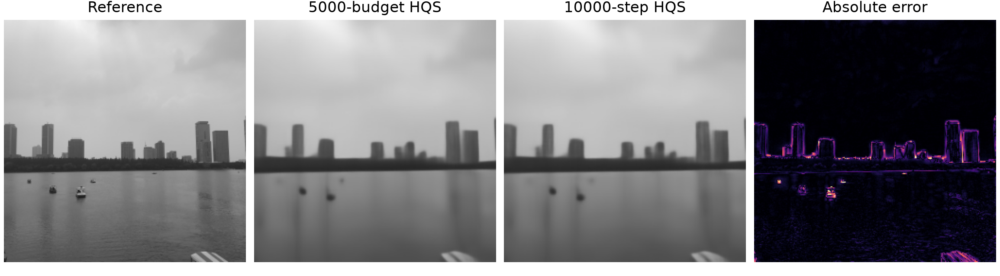

# Single-Pixel Reconstruction: Controlled Fine-Tuning and Nanjing Web-Scene Tests

Zicong Luo (522026230043), Shuhao Yang (502026230083), Yubowen Li (502026230092)

## Abstract

We compare adjoint reconstruction, DCT-FISTA and released HQS/ADMM networks under matched simulated single-pixel measurements. The original study is extended with public Kodak24, raw laboratory-held HEVC frames, controlled HQS fine-tuning and 30 externally authored photographs of Nanjing University and Nanjing sights. All sensing factors remain fixed. A validation-selected 10000-step state is compared with official, 100-step and 5000-budget checkpoints on the same photographs. At clean 10% sampling, the 10000-step state reduces mean MSE by +1.73% on campus, +1.91% on scenic versus the 100-step state. The 5% minimum is not met on both subsets. Every negative condition is retained. The web collection is prepared by the team, not photographed by the team.

## 1. Problem and Prior Work

Single-pixel imaging uses known spatial masks and integrated detector responses [1]. We simulate acquisition from existing 256 x 256 grayscale images. ProxUnroll [2] supplies a shared convolution/attention restorer within a short optimization trajectory. Architecture and released weights are attributed to the authors. DCT-FISTA [3] is a classical sparse comparison, not the original 2008 hardware system.

## 2. Measurement and Solver Contract

Y = H X W<super>T</super> + E. The adjoint H<super>T</super> Y W maps measurements to image space. DCT-FISTA applies gradient descent, DCT soft thresholding and momentum for 200 iterations. Lambda 0.001 comes from the original separate validation images, before external tests. HQS alternates residual correction with learned restoration. ADMM adds a dual variable. Six-stage feature memory links iterations of one image; it never links video frames.

Every method receives identical common-MAT factor rows and measurement values. The external MAT overrides checkpoint-native sensing factors, including ADMM. Nominal clean sampling ratios are 1%, 4%, 10%, 25% and 50%. Available row counts determine actual ratios; 181 x 181 measurements realize 49.9893% at nominal 50%.

At 10%, zero-mean Gaussian measurement noise has relative RMS 0.01 or 0.05. Three fixed seeds repeat each noisy case. Predictions are clipped to [0,1] only for metrics and display. PSNR and skimage SSIM use data_range 1 with no border crop. Headline metrics precede PNG quantization. Percent improvement means 100(1 - mean new MSE / mean reference MSE), not percent PSNR change.

## 3. Data, Provenance and Splits

Preserved evaluations include Kodak24 and eight HEVC B/E videos with three spaced raw Y frames each. Manifests retain video names, dimensions, 8-bit planar YUV420 layout, byte counts and frame indices 0, floor(N/3), floor(2N/3). Stored Y/255 is preserved because reliable range metadata are absent. Entire videos are test-only. These are public or laboratory-held data, not our own captures.

The new web collection contains 18 NJU campus photographs: nine Gulou and nine Xianlin. Twelve scenic photographs cover Xuanwu Lake, Sun Yat-sen Mausoleum, Ming Xiaoling and Qinhuai/Fuzimiao, three each. Sources were chosen by location and visual coverage before reconstruction, with no performance filtering. It includes buildings, greenery, water, text, aerial views and night scenes.

Wikimedia Commons file pages document external authors and CC BY, CC BY-SA or CC0 licenses. ATTRIBUTION.md provides all 30 titles, authors, source and license links. We chose an available CC license where files are dual-licensed. Source captions and a pre-inference contact-sheet review establish scene identity; this is a convenience collection, not random campus sampling.

Direct image retrieval timed out. The downloader therefore requests full-resolution PNG transcodes through wsrv.nl, without requested resizing, cropping or filtering. Dimensions and downloaded PNG hashes are recorded. These are not original JPEG byte files; codec and color-profile handling can differ from decoding originals. The source PNGs remain locally retained, while the exact evaluated grayscale inputs accompany the Git evidence bundle.

For all external still photographs we apply EXIF orientation, the largest centered square, OpenCV RGB2YCrCb Y and INTER_AREA resize to 256 x 256, then uint8/255. Every manifest records crop coordinates and dimensions. Center cropping discards lateral content, and resizing changes high-frequency detail. Source and processed duplicates are checked before inference. Related viewpoints and repeated photographers remain disclosed.

The new 30 photographs are used only for test. Training uses 800 official DIV2K [4] training originals and 16 separate validation originals. Source-image split assignment precedes random crops or flips. Earlier Kodak/HEVC and 32 DIV2K test results are explicitly preserved regression evidence. Fifty-two additional DIV2K originals were locked before continuation but have not yet been evaluated. Public-image exposure during official pretraining is not fully audited.

## 3.1. Equal Photographic Units

Noise repeats average within each photograph, then all originals contribute equal weight. Campus/scenic subsets and all six locations are reported separately. Earlier video means average frames within each video before equal video weighting. Related photographs are not asserted statistically independent; web-test percentages are descriptive, without a population confidence claim.

## 4. Four-Method Web Controls

Table 1 shows clean 10% PSNR in dB. The same collection, operator and measurement realizations are used for all methods. Neural models use CUDA; FISTA and adjoint use CPU. Timings are synchronized after warmup but are not a same-device algorithm-speed benchmark.

Dataset | Adjoint | FISTA | HQS | ADMM

Campus18 | 23.92 | 24.60 | 28.35 | 28.38

Scenic12 | 25.39 | 26.29 | 31.10 | 31.17

## 5. Controlled HQS Fine-Tuning

The 100-step pilot initializes official HQS. Round 2 initializes its validation-selected weights with a new Adam optimizer at 1e-5; this is fine-tuning initialization. Subsequent continuation restores full model, optimizer, scheduler, step and Python/NumPy/Torch/CUDA RNG state. All six H/W sensing tensors stay frozen; 427 reconstruction tensors change.

Batch-one FP32 training draws sampling ratios .01,.04,.1,.1,.1,.25,.25,.5 and relative noise 0,0,.01,.05 independently. Direct-ground-truth RMSE weights five intermediate outputs at .01 each and the final at .95. Training coverage, objective and noise augmentation changed together relative to the pilot; their separate causal effects are unmeasured.

Validation averages 16 originals at 10%/25% sampling and noise 0/.01/.05. Mixed PSNR selects the best eligible checkpoint, subject to clean validation within 0.03 dB of initialization. Initialization is eligible. No web-test result chooses a checkpoint, changes the recipe or triggers more training.

## 5.1. Actual Completion and Recovery

Verified peer 192.168.1.244, container luozc_mlvc, project /workspace/ProxUnroll-main. Project-local Python 3.11.11 and PyTorch 2.6.0+cu124 keep other environments intact. A UUID-selected RTX 3090 runs bounded detached training. Continuation adds 5000 updates to reach 10000, with a 150-minute bound. It completes in 125.2 min; all round-2 phases total 247.0 min. Peak allocated memory is 10.84 GiB.

Training exits with code 0 and step_limit. Independent audit checks 10000 recorded optimizer updates, finite losses/gradients, unchanged sensing factors, selected-step consistency and recomputed measurement hashes. Selected best.pth and full-state last.pth are reopened and hashed. Earlier 3+1 and 6-to-7 checks match uninterrupted updates bitwise for parameters, optimizer and RNG. The complete recovery state is distinct from the inference-only selected weights.

## 6. Web-Test Error Changes

Table 2 gives clean 10% MSE reductions for the 10000-step checkpoint. Official and 100-step references test overall recipe changes; the 5000-budget reference isolates continuation under the same round-2 update rule, while validation still selects weights.

Dataset | vs official | vs 100-step | vs 5000

Campus18 | +3.90% | +1.73% | +0.37%

Scenic12 | +5.24% | +1.91% | +0.47%

At clean 10% sampling, the 10000-step state reduces mean MSE by +1.73% on campus, +1.91% on scenic versus the 100-step state. The 5% minimum is not met on both subsets.

Earlier fresh DIV2K32 showed only 1.84% clean 10% MSE reduction for the 5000-budget model versus the 100-step pilot. That independent result remains in its original report. New web photographs cannot retrospectively turn that result into a successful 5% claim.

## 6.1. Noise and Location Results

Table 3 gives 10000-step MSE reductions versus the 100-step pilot for every location. Campus sites have nine photographs each; scenic sites have three. Noise .05 averages all three fixed seeds, not a favorable realization.

Location (photos) | Clean | Noise .05

NJU Gulou (9) | +1.52% | +16.37%

NJU Xianlin (9) | +2.14% | +30.65%

Xuanwu Lake (3) | +1.44% | +48.27%

Sun Yat-sen (3) | +2.54% | +30.12%

Ming Xiaoling (3) | +0.80% | +13.11%

Qinhuai/Fuzimiao (3) | +2.79% | +7.39%

At 10% sampling, subset reductions under clean/.01/.05 noise are campus: +1.73%/+2.06%/+22.76%; scenic: +1.91%/+2.37%/+24.90%. Strong-noise gains and clean gains are separate outcomes.

## 6.2. Complete Evidence

Full inference saves 2310 main rows, 9900 stage rows and 330 matched conditions. Independent verification recalculates all 2310 retained floating-point reconstructions and regenerates each measurement hash. Data, checkpoint, source and matrix hashes match. Every method shares each measurement. All location and image deltas remain in CSV.

Among 330 conditions, the 10000-step state increases MSE in 9 versus official HQS, 20 versus the pilot and 84 versus the 5000-budget model. Negative-case CSV retains every affected image, ratio, noise seed and reference. We do not select only improved photographs for the main tables.

## 7. Failure Analysis and Limits

This clean 1% Xuanwu Lake view contains small boats, building outlines and water ripples. Both states blur these details; continued training raises overall MSE by 10.70%. A post-test diagnostic partitions the image into sky rows 0-105, skyline 106-161 and water 162-255. Skyline MSE rises 14.02% (0.001351 to 0.001541), compared with 8.72% in sky and 5.27% in water. The error map supports localized boundary/texture mismatch. Smoothing unsupported high frequencies is a plausible learned-prior effect, but its training cause is not isolated by an ablation. These regions were chosen after testing for diagnosis, not model selection.

玄武湖13.jpg; 西安兵马俑; CC BY-SA 4.0. Source and license: <link href='https://commons.wikimedia.org/wiki/File:%E7%8E%84%E6%AD%A6%E6%B9%9613.jpg'>Commons file</link>, <link href='https://creativecommons.org/licenses/by-sa/4.0/'>license</link>. Gray crop, resize, reconstruction and error-map adaptations.

One training seed and one bounded recipe do not establish universal improvement. Public web photographs may overlap unknown official pretraining exposure. Related views and photographers limit independence. Cropped grayscale simulation omits detector calibration, physical masks, photon statistics and full color acquisition. Independent HEVC frames do not demonstrate a temporal video model.

## 8. Reproducibility and Course Status

runs/nanjing_web30_20261009 contains locked manifests, attribution, protocol, smoke and comparison. CSV, float arrays, PNGs, versions and hashes are retained. runs/lab244_10000_20261009/finetune retains selected and recovery weights. Logs preserve a repaired aggregation-save failure as well as inference/verification completion. Exact commands are in coursework/NANJING_WEB30.md. Linux measurement hashes are audited; other CPU matrix-product implementations can differ at float32 roundoff. Earlier reports remain preserved.

The six-page technical report, four-method experiments, failure analysis, three-page literature review and 12-slide presentation meet the corresponding artifact requirements. Team-curated web images do not satisfy optional self-capture. Timed rehearsal, student understanding, course registration and course submission remain human course activities. No additional training is launched from these test outcomes.

## AI Disclosure

Codex assisted with code, remote execution, analysis, English writing and slides. Students should review and understand the work. Architecture and official weights belong to the cited authors; image authors retain attribution and licenses.

## References

[1] Duarte et al. Single-Pixel Imaging via Compressive Sampling. IEEE SPM, 2008. doi:10.1109/MSP.2007.914730.

[2] Wang et al. Proximal Algorithm Unrolling. CVPR 2025. arXiv:2505.23180; github.com/pwangcs/ProxUnroll.

[3] Beck and Teboulle. FISTA. SIAM J. Imaging Sciences, 2009. doi:10.1137/080716542.

[4] Agustsson and Timofte. DIV2K / NTIRE. CVPR Workshops 2017; data.vision.ee.ethz.ch/cvl/DIV2K/.
